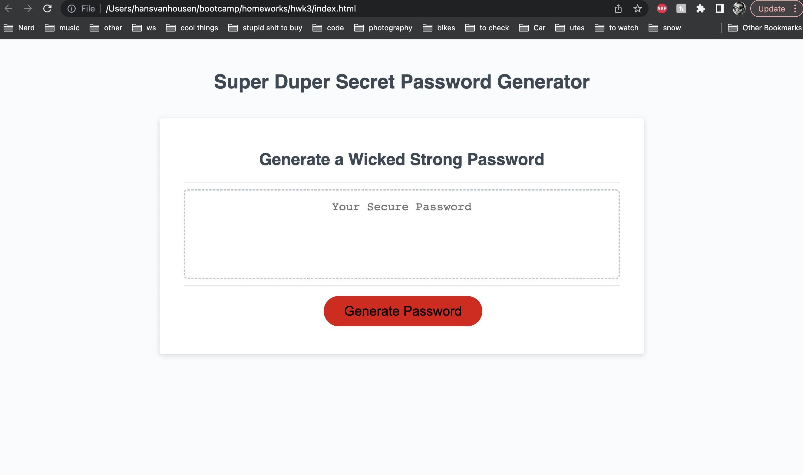

03 JavaScript: Password Generator
This web page is made to generate a random password anywhere from 8 to 127 characters in length using uppcase and lowercase letters as well as numbers and special characters as defined in the code. Below are links, screen shots and Acceptance Criteria, and grading requirements. 
github repo: 
deployed ap:

screenshot: 
screenshot of git issue. I had finished this project, and then when I went to make a push to my remote repo I got a bunch of erros. I had a TA help, but then it happened again, and then  tutor tried and failed to fix it easily, so I am now just coping and pasting the content over. This screenshot is really just to show that I had been making commits over the course of a few days, and not all within 20 minutes. 

User Story
AS AN employee with access to sensitive data
I WANT to randomly generate a password that meets certain criteria
SO THAT I can create a strong password that provides greater security
Acceptance Criteria
GIVEN I need a new, secure password
WHEN I click the button to generate a password
THEN I am presented with a series of prompts for password criteria
WHEN prompted for password criteria
THEN I select which criteria to include in the password
WHEN prompted for the length of the password
THEN I choose a length of at least 8 characters and no more than 128 characters
WHEN asked for character types to include in the password
THEN I confirm whether or not to include lowercase, uppercase, numeric, and/or special characters
WHEN I answer each prompt
THEN my input should be validated and at least one character type should be selected
WHEN all prompts are answered
THEN a password is generated that matches the selected criteria
WHEN the password is generated
THEN the password is either displayed in an alert or written to the page
Mock-Up
The following image shows the web application's appearance and functionality:

The Password Generator application displays a red button to "Generate Password".

Grading Requirements
Note: If a Challenge assignment submission is marked as “0”, it is considered incomplete and will not count towards your graduation requirements. Examples of incomplete submissions include the following:

A repository that has no code

A repository that includes a unique name but nothing else

A repository that includes only a README file but nothing else

A repository that only includes starter code

This Challenge is graded based on the following criteria:

Technical Acceptance Criteria: 40%
Satisfies all of the preceding acceptance criteria.
Deployment: 32%
Application deployed at live URL.

Application loads with no errors.

Application GitHub URL submitted.

GitHub repository that contains application code.

Application Quality: 15%
Application user experience is intuitive and easy to navigate.

Application user interface style is clean and polished.

Application resembles the mock-up functionality provided in the Challenge instructions.

Repository Quality: 13%
Repository has a unique name.

Repository follows best practices for file structure and naming conventions.

Repository follows best practices for class/id naming conventions, indentation, quality comments, etc.

Repository contains multiple descriptive commit messages.

Repository contains quality readme file with description, screenshot, and link to deployed application.

Review
You are required to submit the following for review:

The URL of the deployed application.

The URL of the GitHub repository, with a unique name and a readme describing the project.

© 2022 Trilogy Education Services, LLC, a 2U, Inc. brand. Confidential and Proprietary. All Rights Reserved.